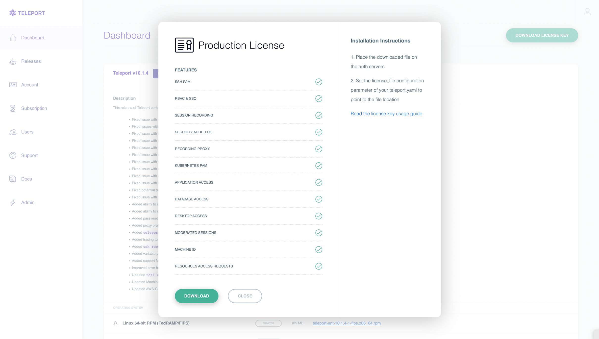

This guide shows you how to get up and running with Teleport Enterprise.

You will be deploying three Teleport services on a single host:

- The **Auth Service** stores user accounts and your cluster configuration, and
  provides authentication and authorization for every Teleport service and every
  user in your cluster.
- The **Proxy Service** routes client connection requests to the appropriate
  Teleport service and serves a Web UI that you can use to access resources or
  manage the cluster.
- The **SSH Service**  is an SSH server implementation that provides seamless
  access to Linux hosts in your cluster. 

  SSH Service instances are called **Teleport Nodes**. When a Teleport Node
  receives a connection request, the request is authenticated through the
  cluster's Auth Service.

  Other Teleport services provide access to remote desktops, Kubernetes
  clusters, applications, and databases.

You will install the `teleport` binary, which runs runs all three of these
services by default.

You will also use the following client tools:

| Tool | Description |
| - | - |
| `tctl` | Cluster administration tool used to invite Nodes to a cluster and manage user accounts. |
| `tsh` | Allows users to authenticate and access resources via their local machine. `tsh`'s SSH functionality is similar in principle to OpenSSH's `ssh`. Users can log in to remote Nodes, list and search for Nodes in a cluster, securely upload/download files, etc. |
| Web UI | You can use the Teleport Web UI to log in to any Teleport Node by opening `https://<proxy-host>`. |

## Prerequisites

- A Teleport Enterprise account. Use our [signup
  form](https://goteleport.com/signup/enterprise/) to schedule a demo with the
  Teleport Sales Team.
- A host where you will run the Teleport Auth Service, Proxy Service, and SSH
  Service. We assume that the host uses systemd as its init system.
- Either a registered domain name or a self-hosted authoritative DNS name
  server.

## Step 1/ . Create a DNS record

{/* TODO*/}

## Step 1/ . Set up Teleport

### Obtain your license file

The `teleport` binary reads a local license file to authenticate your Teleport
Enterprise account.

To obtain your license file, visit the [Teleport customer
dashboard](https://dashboard.gravitational.com/web/login). Click "DOWNLOAD
LICENSE KEY". You will see your current Teleport Enterprise account permissions
and the option to download your license file:



Save your license file to the host where you will install Teleport at the path,
`/var/lib/teleport/license.pem`.

### Install the `teleport` binary

On the host where you will run your Teleport services, run the following
commands to install the `teleport` binary:

<Details title="Need FedRAMP/FIPs compliance?">

For FedRAMP/FIPS-compliant installations of Teleport Enterprise, package URLs
will be slightly different:

```code
$ curl https://get.gravitational.com/teleport-ent-v(=teleport.version=)-linux-amd64-fips-bin.tar.gz.sha256
# <checksum> <filename>
$ curl -O https://get.gravitational.com/teleport-ent-v(=teleport.version=)-linux-amd64-fips-bin.tar.gz
$ shasum -a 256 teleport-ent-v(=teleport.version=)-linux-amd64-fips-bin.tar.gz
# Verify that the checksums match
$ tar -xzf teleport-ent-v(=teleport.version=)-linux-amd64-fips-bin.tar.gz
$ cd teleport-ent
$ sudo ./install
```

</Details>

```code
$ curl https://get.gravitational.com/teleport-ent-v(=teleport.version=)-linux-amd64-bin.tar.gz.sha256
# <checksum> <filename>
$ curl -O https://get.gravitational.com/teleport-ent-v(=teleport.version=)-linux-amd64-bin.tar.gz
$ shasum -a 256 teleport-ent-v(=teleport.version=)-linux-amd64-bin.tar.gz
# Verify that the checksums match
$ tar -xzf teleport-ent-v(=teleport.version=)-linux-amd64-bin.tar.gz
$ cd teleport-ent
$ sudo ./install
```

{/* TODO: I deleted the instructions to copy the example systemd unit file. Make
sure the `./install` command adds the unit*/}

### Configure Teleport

{/* TODO: Add a section re: how to do this based on the latest instructions.
The current guide has the user copy a static file*/}

### Start Teleport 

Start the Teleport service and confirm the service has started: 

```code
$ sudo systemctl start teleport
# confirm Teleport started
$ sudo systemctl status teleport
```

### Get information about your Teleport deployment

You can review the logs of the Teleport service with the following command:

```code
$ journalctl -fu teleport
```
Run the following command to review the port that Teleport is
listening on:

```code
$ netstat -lptne
```

The output should look something like this:

{/* TODO: Update this since we're running one host*/}

```code
$ auth.example.com ~: sudo netstat -lptne
Active Internet connections (only servers)
Proto Recv-Q Send-Q Local Address   State       User       PID/Program name
tcp6       0      0 :::3024         LISTEN      0          337/teleport
tcp6       0      0 :::3025         LISTEN      0          337/teleport
tcp6       0      0 :::3080         LISTEN      0          337/teleport
tcp6       0      0 :::3022         LISTEN      0          337/teleport
tcp6       0      0 :::3023         LISTEN      0          337/teleport
```

## Step 2/ . Add a local user

This portion of the Quick Start Guide should be performed on the auth server, i.e.
on *auth.example.com*

### Create a  user

Every user in a Teleport cluster must be assigned at least one role. By default,
Teleport comes with several pre-configured roles known as
["presets"](../access-controls/reference.mdx#preset-roles). You can see
these roles by executing `sudo tctl get roles`.

Pay attention to the *allow/logins* field in the role definition: by default, this
role only allows SSH logins as `root@host`.

```yaml
kind: role
metadata:
  name: access
spec:
  allow:
    logins:
    - '{{internal.logins}}'
    - root
```

You probably want to replace "root" with something else. Let's assume there will
be a local UNIX account called "admin" on all hosts. In this case you can
dump the role definition YAML into a file and update "allow/logins"
to look like this:

```yaml
allow:
   logins: [admin]
```

Then send it back into Teleport:

```code
$ sudo tctl create -f role.yaml
```

Now, lets create a new Teleport user "joe" with "access" role:

```code
$ sudo tctl users add --roles=access --logins=joe,ubuntu,ec2-user joe

Signup token has been created and is valid for 1 hours. Share this URL with the user:
https://auth.example.com:3080/web/newuser/22e3acb6a0c2cde22f13bdc879ff9d2a
```

Share the generated sign-up URL with Joe and let him pick a password and configure
the second factor authentication. We recommend [Google Authenticator](https://en.wikipedia.org/wiki/Google_Authenticator)
which is available for both Android and iPhone.

### Update the user's roles

To update user's roles, dump the user resource into a file:

```code
$ sudo tctl get users/joe > joe.yaml
```

Edit the YAML file and update the "roles" array.
Then, re-insert it back:

```code
$ sudo tctl create -f joe.yaml
```

### Log in as your new user

Joe now has a local account on a Teleport cluster. The local account is good for
administrative purposes but regular users of Teleport Enterprise should be using
a Single Sign-On (SSO) mechanism.

But first, lets see how Joe can log into the Teleport cluster. He can do this
on his client laptop:

```code
$ tsh --proxy=auth.example.com --insecure login --user=joe
```

Note that "--user=joe" part can be omitted if `$USER` environment variable is "joe".

Notice that `tsh` client always needs `--proxy` flag because all client connections
in Teleport always must to go through an SSH proxy, sometimes called an "SSH bastion"

If successful, `tsh login` command will receive Joe's user certificate and will
store it in `~/.tsh/keys/<proxy>` directory.

With a certificate in place, Joe can now interact with the Teleport cluster:

```code
# See what hosts are available behind the proxy:
$ tsh ls

# SSH into any host behind the proxy (Unix user 'joe' should already exist on the node):
$ tsh ssh joe@node.example.com

# Log out (this will remove the user certificate from ~/.tsh)
$ tsh logout
```

<Details title="tsh not showing Nodes?" opened={false}>

(!docs/pages/includes/node-logins.mdx!)

</Details>

## Next steps

### Deploy on Kubernetes

This guide shows you how to install Teleport Enterprise on a virtual machine. If
you are using a Kubernetes-based environment, see our [Getting Started
Guide](../getting-started/kubernetes-cluster.mdx) for how to deploy Teleport on
Kubernetes.

### Configure SSO

The local account you created in this guide is well suited for managing yoru
cluster. For on– and offboarding regular users, you should use one of Teleport's
Single Sign-On integrations.

Take a look at our [Single Sign-on](sso.mdx) guide to learn the basics of
integrating Teleport with SSO providers. We have the following detailed guides
for configuring SSO providers:

- [Active Directory](sso/adfs.mdx)
- [Azure AD](sso/azuread.mdx)
- [GitHub](../setup/admin/github-sso.mdx)
- [GitLab](sso/gitlab.mdx)
- [Google Workspace](sso/google-workspace.mdx)
- [OIDC](sso/oidc.mdx)
- [Okta](sso/okta.mdx)
- [Okta](sso/okta.mdx)
- [One Login](sso/one-login.mdx)

You can configure any SAML– or OIDC-compliant identity provider to enable SSO
for Teleport. There are Teleport Enterprise customers who are using Oracle IDM,
SailPoint, and others.

{/* TODO:

- Configure access requests
- Add resources

*/}

## Troubleshooting

If Teleport services do not start, take a look at the syslog:

```code
$ sudo journalctl -fu teleport
```

Usually the error will be reported there. Common reasons for failure are:

- Mismatched tokens, i.e. "auth_token" on the node does not match "tokens/node" value on the auth server.
- Network issues: port `3025` is closed via iptables.
- Network issues: ports `3025` or `3022` are occupied by another process.
- Disk issues: Teleport fails to create `/var/lib/teleport` because the volume is read-only or not accessible.

## Getting Help

If something is not working, please reach out to us by creating a ticket in your [customer portal](https://dashboard.gravitational.com/web/login).
Customers who have purchased the premium support package can also ping us through
your Slack channel.

